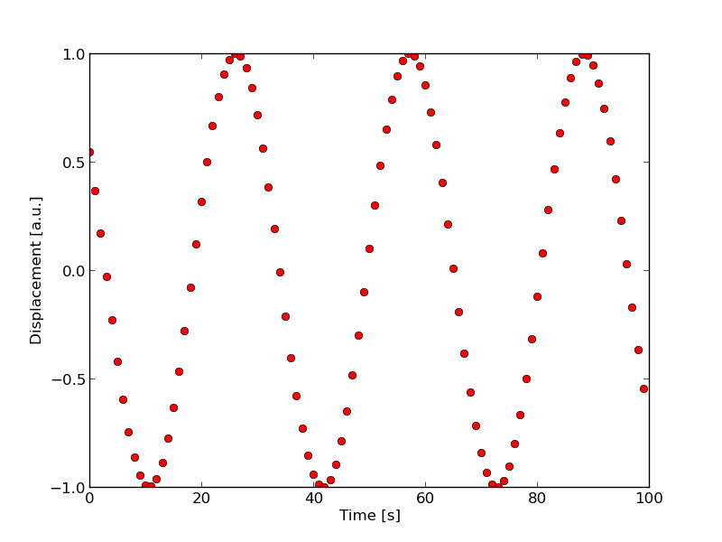

# Comments on using the nothon notebook

## Introduction

On the following pages, we would like to outline the rationale behind the creation of *nothon*, and give the user a couple of tips on the efficient use of the notebook. At the end, we will also show how the behaviour of nothon can be customised, and how new features can easily be added.

## Why another wiki?

Or, put differently, what is wrong with wikis in general? There are several problems with the traditional wiki approach. 

* Extra content (images, sound etc.) has to be uploaded to a server, creating a storage/management overhead. Besides, one can never be certain that the image displayed in the wiki is the most recent one. 
* Formatting cannot be done, and formulae cannot be edited in-place: one has to invoke the editor mode for each section.
* There is no way of creating content in the wiki page itself (we mean data external to the wiki page itself. E.g., a figure/plot has to be created in an external application, and then uploaded to the server).
* There is no way of interacting with the underlying file system. Anything displayed in the wiki is part of the server storage facility, and one cannot obtain information of a particular file on the file system. 
The first of the problems was alleviated in the excellent zim-wiki project, which, exactly because it doesn't require a server, works with the underlying file system. In some respect, the third point was also addressed in zim, namely, there is a way of creating plots and formulae on the fly. However, formulae require a LaTeX system, which has its own problems, while the script that generates the plot is hidden. This can be an advantage or disadvantage, depending on the particular situation (or the preferences of the user). But, unfortunately, this is all that can be said about wiki-file system interaction. 
\hrulefill
When we set out to develop nothon, we wanted to rectify the above-mentioned problems. However, since the desire was to create a system that can be used for documenting various projects (both experimental, and theoretical/numerical), we also wanted to include tools that would make project management easy. Thus, we envisaged the following features.

* Easy customisation: in terms of both adding extensions, and the look and feel of the wiki. We also thought that customisation is a rather important subject in the sense that we cannot possibly think of all uses, and we wanted to implement a wiki in a way that can be modified via a plug-in infrastructure. 
* Integration of a (or multiple) scientific plotting utility. 
* Some interaction with the file system. This would include accessing the content of data files, and retrieving and highlighting the content of software code. On can also think about saving particular cells of a document. E.g., the script producing a figure could be saved as a stand-alone file. 
* Portability.
As for the first point, the browser seemed to be a natural choice: given the HTML content, customisation can be done with the help of cascaded stylesheets. In this way, not only could we completely decouple the content from the presentation, but the decoupling would work at the level of the code, too. In other words, the server-client separation naturally lends itself to a double-headed implementation: the server can deal with access to the file system, plotting and the like, while the browser's responsibility is to handle the user interaction, and display the content in whatever way that suits the user.  Resorting to the browser has the additional benefit that the content of a notebook can easily converted to a format that is widely used, and portability is not a problem either. 

## Beginning with nothon - Installing on a computer

The most recent version of the source code resides at  Linkhttps://github.com/v923z/nothon The code has minimal dependencies, all of which are in the repositories on most Linux distribution. For example, for Ubuntu 13.04 execute on the command linesudo apt-get install python-webpy python-simplejson python-bs4 python-pygmentsIn order to have plotting, either matplotlib, or gnuplot has to be installed as well.After starting nothon.py, the notebook can be accessed from the browser at address http://127.0.0.1:8080/?name=somenotebook.noteIf the notebook exists (this should be a JSON file), then its content will be rendered in the browser. If it doesn't exist, then a new notebook with that name will be created. When saving this notebook, its content will be written to disc under the name somenotebook.note. 

## Installing on an android device

One of our design considerations was from day one that one should be able to run nothon on an android device. Therefore, we implemented everything with minimal dependencies: the core server can run with python, and the web, and simplejson packages installed. Of course, if plotting and code highlighting is required, additional packages can be installed. (It should be noted, however, that code segments can still be listed, but without highlighting.) At least one of these packages, matplotlib, is not available on the android platform. In order to run nothon on a tablet/cell phone, one would have to install the following:

* The scripting layer for android,   Linkhttp://code.google.com/p/android-scripting/ 
* The extra packages from SL4A. (simplejson requires this).
* QPython Linkhttps://play.google.com/store/apps/details?id=com.hipipal.qpyplus 
* web.py. This can be gotten from Linkhttp://pypi.qpython.org/index.php/qpython-libraries/

## Cells in nothon

The content of a notebook is divided into cells, each cell type dealing with particular task. Currently five cell types are implemented, but it is easy to extend this.

* Section cell: contains text, with a header
* Paragraph cell: contains text without a header
* Plot cell: contains a header (caption), the code that generates the plot, and the plot itself
* Code cell: contains a header with a file name, and the listed code
* Head cell: contains a header with a file name, and the listed file content.

## Usage in general terms

Headers in text, code, and head blocks are evaluated by pressing `Enter`. This moves the cursor to the body of a text header, or sends a request to the server to execute and return the output of the corresponding handler function. Units can be "executed" by pressing `Cntr+Enter`. This will render mathematical formulae in a text block, or execute a plot. If `Shift+Enter` is pressed, a new block of the same type is also inserted into the notebook.Blocks of the document can be moved up or down by clicking on the up or down arrow on the right hand side. 

## Using the nothon menus

As a general rule, all labels, buttons etc. of nothon can be hidden: they are there to help the user, but not to distract them. Therefore, when not needed, the user can hide everything except the notebook itself. At the top of the notebook, a toolbar can be found. This contains links to various actions. 

* Organise contains two functions with the help of which one can overview the notebook list. ToC and Timeline refer to the table of contents (a list of all content-manageable headers of all notebooks), and an ordered list of all notebooks in the Calendar section. When pressing either button, the user is taken to a new page, which is generated on the fly, and cannot be saved. 
* The Notebook button gives access to saving, and various converting 
functions (saving in HTML and LaTeX format), and collapsing/expanding all 
cells of the notebook. The user has to convert the resulting LaTeX document on the command line. The reason for this is that it is not trivial to catch all the errors/warnings of LaTeX, and therefore, it would be hard to give a meaningful  report to the user. 
* The Cell button insert a new cell of the chosen type. If there is an active cell in the notebook, this can be deleted, or the last cell or the active cell of the trashbin can be recovered here.
* The Menu button toggles the context-dependent menu on the right hand 
side. This sidebar contains commands relevant to the currently active 
cell. On the top of the menu, the type of the currently active cell is 
also shown. The Hide button in Menu hides the toolbar. It can be made to reappear by moving the mouse to the very top of the page. 
* With the help of Tools, the calendar can be toggled, and the calculator (see later) can be activated.

## Customisation

The visual appearance of a notebook can be influenced by changing the appropriate parameters in the cascaded style sheet. These modifications do not change the behaviour of the server or the client. Several aspects of the behaviour of the server can be customised in a resource file (in future versions, this will be extended to the client, too.) By default, only png files are created, when the user plots in the notebook. By changing the value of the variable self.plot_pdf_output to True, the plotting backend will generate pdf output, too. This output can later be included in latex files. The ordering of the directory tree (on the left hand side of the browser window, although, again, the position of this can be modified in the CSS file) can be customised. By default, the server sends the tree ordered linux style, i.e., in each folder, the files are listed first, and then the folders. By setting the variable self.dirlisting_style to "windows", folders will be shown first, and then files.When working with code (see below), it might be useful to include only a function or a segment of a code file. This can be done by defining a start and end tag in the source code, and supplying that to the code handler. In order for the code highlighter to know what amounts to the beginning/ending of a code segment, the tag is prepended and appended with a beginning/closing string. This can be defined in the variable self.code_delimiter. E.g., if self.code_delimiter = ('*-', '-*'), then the code should be enclosed between the tags     *- some_tag    .... code ....   some_tag -*The user can define arbitrary tag combination. 

## Code segments 1.

Arbitrary code files on the hard disc can be displayed conveniently. All one has to do is give the file name in the header (the only editable div) of a code cell.

**helper.py**

**Created: Fri Mar 22 21:05:47 2013, modified: Fri Mar 22 21:05:47 2013**

	import os
	
	def retreive_header(args):
		head = args.split(' ')
		sp = head[0].split(' ')
		if not os.path.exists(sp[0]): 
			return "File doesn't exist"
		if len(sp) == 1: n = 10
		# TODO: elif sp[1] == '#':	
		else: n = int(sp[1])
		fin = open(sp[0], 'r')	
		# *- function_something 
		if n > 0:
			lines = []
			it = 0
			for line in fin:
				lines.append(line.rstrip('\n\r'))
				it += 1
				if it >= n: break
		# function_something -*
		if n < 0:
			lines = fin.readlines()
			lines = lines[-10:]
		fin.close()	
		return ' '.join([x.rstrip('\n\r') for x in lines])
	

## Working with code 2.

Code lines can be numbered by adding -lineno on the command line. In addition, if a start and end tag are defined in the source file, the code highlighter can be made to display only the segment between the two strings. If -include is specified on the command line, the tags are also included in the highlit code. This can be useful when one wants to emphasise that we are dealing with a code segment only.

**helper.py -lineno -tag function_something -include**

**Created: Fri Mar 22 21:05:47 2013, modified: Fri Mar 22 21:05:47 2013**

		# *- function_something 
		if n > 0:
			lines = []
			it = 0
			for line in fin:
				lines.append(line.rstrip('\n\r'))
				it += 1
				if it >= n: break
		# function_something -*
	

## Working with headers 1.

This functionality is handy, if one wants to list the content of some file. We only have to enter the file name, and press enter. Additionally, an argument can be supplied, in which case, only the first or last n lines will be printed.

**test.dat**

**Created: Sat Dec 15 23:54:22 2012, modified: Sat Dec 15 23:53:33 2012**

\# comment 1 \# comment 2 12 3 23 22 2132 123 55 99

## Working with headers 2.

If we supply an argument, we can print the first or last n lines as follows.

**test.dat 2**

**Created: Sat Dec 15 23:54:22 2012, modified: Sat Dec 15 23:53:33 2012**

\# comment 1 \# comment 2

**test.dat -2**

**Created: Sat Dec 15 23:54:22 2012, modified: Sat Dec 15 23:53:33 2012**

2132 123 55 99

## Adding plots

Plots can easily be included in a notebook. A plot cell has three usable subcells. The first one is the caption/title of the plot. This will be included in the table of contents, and this will also be used as the caption, when one converts the notebook to pdf via LaTeX. The second cell is the matplotlib code that generates the plot. At the time of writing this, this code is going to be included in the pdf output, while in the notebook, it can be made hidden by clicking on the gray arrow at the top. The third subcell is the plot itself. In case the plot cannot be generated (e.g., due to a syntax error in the code), the traceback will be returned instead. A link to the file that was generated is also displayed. If this feature is not required, the corresponding div, .div_plot_file, can be set to **display: none;** in the CSS. This would still save the link in the json file, so that later on it can still be retrieved, but the content will not be displayed. Note that gnuplot also can be used as the plotting backend by adding #gnuplot or # gnuplot on the first line of the code.

plot(sin(x), 'ro') xlabel('Time [s]') ylabel('Displacement [a.u.]') 

## This is a text box with some LaTeX code

In addition to containing raw text, courtesy of MathJaX, a text box can also deal with LaTeX code. This can be inserted by pressing Cntr-Alt-M (display style), or Alt-M (inline). By default, formulae will be displayed with a light blue background, but this can be changed in the CSS file. Note that by pressing the hotkey combinations above, the user will be presented with empty math containers. However, it is also possible to turn a piece of text into a math formula. If the above-mentioned hotkeys are pressed while some text is selected, this text will become the body of the math formula. After entering the LaTeX code of the formula, it can be rendered by pressing either Cntr-Enter, or Shift-Enter. The formula can be turned to its raw format for future editing by pressing the 'Raw content' button in the context menu, or the Cntr-L hotkey combination. Both of these actions would remove all formulae in the currently active divide, and insert the corresponding LaTeX code in place. However, if necessary, the LaTeX code of a single formula can be recovered with the left mouse click on the blue background. When the user clicks on the raw LaTeX formula, it will be processed, and rendered. References to equations can be added by adding a label to the equation in the usual way, and placing in-line math environment. See the following example:If we wanted to solve the quadratic equation $ax^2 + bx + x = 0$, we would have to look up the solution formula (see Eq. $\eqref{eq:sample}$)
\begin{equation}
x_{1,2} = \frac{-b\pm\sqrt{b^2-4ac}}{2}\label{eq:sample}
\end{equation}

## Markup

Some markup can be added to text. **Cntr-I** is going to make the text *italic*, **Cntr-B** turns it **boldface**,** Cntr-O** adds \colorbox{yellow}{highlighting}, while **Cntr-U** will \underline{underline} the text.Notebooks
 can be converted to pdf via LaTeX by calling python/latex.py with the 
notebook file as the single argument. Customisation of the latex file 
should be done through the templates in templates/. If pdf output is 
needed, self.plot_pdf_output has to be set to True in the resource file.Sticky
 notes can also be added to a section cell by pressing either the 'Note'
 button in the context menu, or the Cntr-A hotkey combination. Sticky 
notes are small yellow boxes that can be collapsed, so that they do not 
take up space. \note{A typical note cell looks like this.}  By clicking on the 'Note' button of the note, the content of the note 
will become hidden. Ordinary text can be turned into a sticky note by 
highlighting it, and then clicking on the 'Note' button. Links 
can be created in a similar fashion. When clicking on 'Link' button, any
 highlighted text will be converted to a link with the text being the 
target and the text of the hyperlink. By clicking on the 'Link' button, 
the hyperlink will be opened for editing, where both the text, and the 
target can be changed.

## Calculator

The notebook features a simple scientific calculator, based on http://mathjs.org/. This is meant to be used as a scratch pad for quick, dirty, and disposable calculations. However, results and instructions can be inserted into a section/paragraph. The calculator history is preserved, even if the user navigates to another notebook.